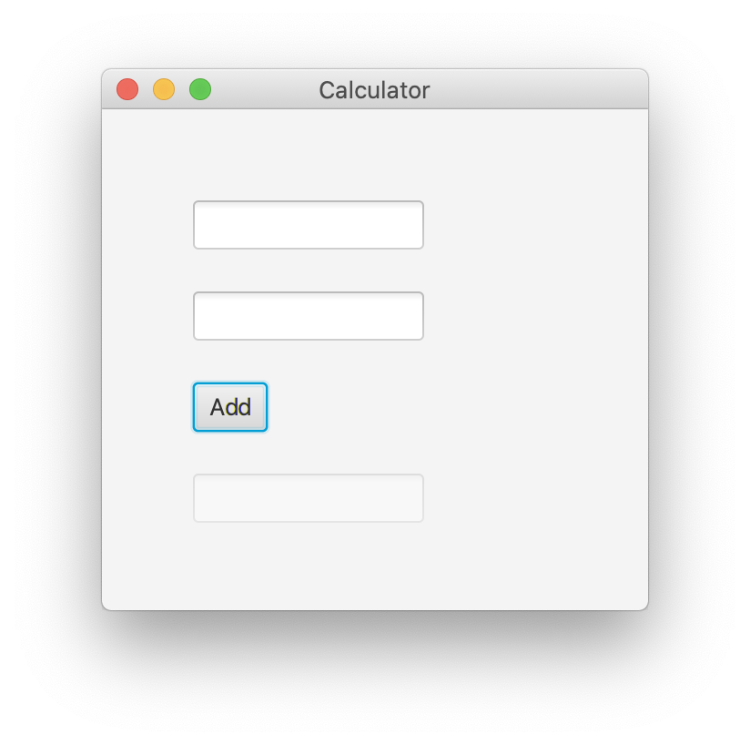

## Simple exercises using JavaFX

### Exercise 1
Using SceneBuilder, create an interface with 2 text fields, a button, and another read-only text field.

- Text field 1 should have the fxId inputOne  
- Text field 2 should have the fxId inputTwo
- The button should have the text 'Add' and the onAction attribute '#add' 
- Text field 3 should have the fxId output and the disabled attribute set to 'true'

In interface should look as following, and addition should work successfully 

